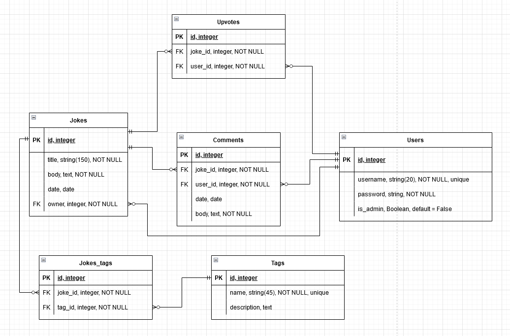

# Jokes Forum API

## [Github repo](https://github.com/Vickyyn/joke-forum-api)
## [Responses](#responses)
## [Installation instructions](#installation)


# Responses
## 1. Identification of the problem you are trying to solve by building this particular app

Problem 1: There are so many jokes that it can be difficult to find and separate the good from the bad.  
Problem 2: It can also be difficult to find good jokes of a particular category.  
Problem 3: It is hard to find a creative outlet to contribute jokes.  
Problem 4: It can be hard to get feedback for jokes you have created.  
Problem 5: It can be difficult to find a community that likes jokes as much as you do.  

The app allows an easy location to find jokes, listing them by popularity via the upvote system. Tags are utilised to allow an easy way to find the most humerous jokes by category. Comments are also allowed on jokes to allow for user interactions, whether it be to express reactions or give feedback, to further explain the joke, or to even add follow-up jokes.

## 2. Why is it a problem that needs solving?

The problems listed in question 1 require solving for a few reasons. 

Firstly, everyone can do with more humour in their life. The ability to view jokes by popularity helps to save time in busy lives (instead of having to trawl through lists of unfunny jokes), hopefully adding a bit more joy to people's lives. 

Secondly, not everyone has the same sense of humour, and the ability to to find top humerous jokes by tags or categories help to overcome that. 

Thirdly, for those wishing to create jokes it can be difficult to gauge feedback as there may be a limited number of people available, or else the particular community (family or friendship group) may have a different sense of humour. By expanding the reach and audience of the creations, with the option for direct feedback via upvotes and comments, a creator can more efficiently craft their art. 

Finally, by providing access to a community of like-minded people, and encouraging creativity and interaction, it will help foster greater emotional and social wellbeing. 

## 3. Why have you chosen this database system. What are the drawbacks compared to others?
PostgreSQL is chosen as the database system. The benefits include my familiarity, it being free and open source, and it being a relational database. Utilising a relational database is applicable to this app due to the interconnecting and rigid structure of components involved. As users interact with jokes and there are many relations between the two with upvotes and comments, a relational database allows easy grouping of data into well defined categories (e.g. users, jokes, comments, upvotes) with well defined attributes (e.g. all users have a username and a password), and easy and efficient relationship mappings to tie everything together (e.g. how a comment will be linked to a user and a joke, and similarly with upvotes). 

Other benefits of PostgreSQL include its excellent data integrity, and ability for concurrency. Deletion, modification and insertion anomalies can be minimised by using entity/referential/domain constraints, for example if a particular joke was deleted then relationships can be set to also delete any corresponding comments and upvotes. Data accuracy can be preserved by ensuring primary keys are unique and ensuring no duplications. Furthermore, as the app grows, the ability for concurrency would ensure improved efficiency for all users that may be using the app at the same time. 

Drawbacks of using a relational database include that it is difficult to work with data that has varying structures. For example, if later on we wanted to change the comment schema to also include a title, then all the existing data would need to be changed, requiring the database to be offline temporarily. Similarly, if the app were to be expanded by allowing direct messaging functionality between users, the varying size and structure of the data that would need to be stored and accessed may make it difficult to implement within the constraint of a relational database. Also, relational databases may require queries to numerous tables to execute an answer, whereas non-relational databases can query the database directly with ease. As the datasets enlarge and complexity increases, relational databases can run into scalability and performance issues.


## 4. Identify and discuss the key functionalities and benefits of an ORM
Object Relational Mapping (ORM) serves as a _bridge_ between _objects_ in an application, and data tables stored in a _relational_ database.

Key functionalities of an ORM include (using Flask and PostgreSQL as an example):
- Connect web application frameworks (e.g. Flask) with the database (e.g. PostgreSQL). This allows direct data manipulation via using programming languages such as Python, Ruby and more. 
- Mapping models (or objects) in Flask to tables in the database. By creating a class object in Flask, this maps to a table in the database. Fields within the object model become attributes in the database table, with appropriate constraints including primary keys, data types, and more.
- Assists with commands to create, drop, and seed tables from objects. This allows the initial set up of the database, for the objects to map to tables in the database, and to allow instances of objects to map to instances/data in the tables. 
- Directly maps creating, reading, updating, and deleting (CRUD) functionalities between Flask and the database. For example takes an input instance and then creates the instance in the database (e.g. SQLAlchemy via session.add(instance) and session.commit()). With the help of a deserialization library (Marshmallow), it also retrieves or reads instances from the database, which is then converted to a readable form by Marshmallow, and the objects outputted (e.g. select or query to select instances from the appropriate table, with option to use filter and order by to fine-tune selections). This can all be done using Python rather than SQL. Further examples include session.delete(instance), mapping updates to instances from Python form to the database, and more. 
- Essentially, ORM allows SQL queries and database interactions to be performed using object-oriented programming of a preferred programming language


Benefits of ORM are:
- Allows coding and manipulation of data in a familiar language (eg Python) rather than SQL. This can greatly boost productivity, and programmers are able to use the language they are most comfortable with
- Make code cleaner by utilising more efficient language/not having to use SQL
- Allows use of object oriented programming, and improved code due to use of a model control view structure, and as the models are stored in one place and not repeated, it is easy to update and maintain code
- It is possible to switch database systems (eg SQLite and MySQL) with minimal code modifications, in case the testing and deployment environments are different, as the database system is abstracted 
- Sanitises incoming data and protects against SQL injections, as only set data types are accepted and the database is not queried using SQL
- Bonus advanced features can come with the ORM, for example support for migrations, transactions, and more 
- easy to use and maintain, do not have to do own convertions from objects to tables and vice versa 


## 5. Document all endpoints for your API

### /
Methods: GET  
Argument: None  
Required data: N/A  
Expected response data: JSON, `{'message': 'Welcome to the jokes forum!'}`  
Authentication method: Nil  
Description: Welcome message, public

## Users Documentation 
### /users/
Methods: GET  
Argument: None  
Required data: N/A  
Expected response data: JSON array of users  
Authentication method: Nil  
Description: List of all users, public  

### /users/\<string:username>/
Methods: GET  
Argument: username (string)  
Required data: N/A  
Expected response data: JSON, corresponding user  
```py
{
    "id": 1,
    "username": "admin",
    "jokes": [],
    "is_admin": true,
    "comments": [
        {
            "id": 1,
            "joke_id": 1,
            "user_id": 1,
            "date": "2022-11-09",
            "body": "What a great joke"
        }
    ]
} 
```
Authentication method: Nil  
Description: View a particular user, public  

### /users/\<int:id>/
Methods: GET  
Argument: id (integer)  
Required data: N/A  
Expected response data: JSON, corresponding user (same as above)  
Authentication method: Nil  
Description: View a particular user, public  

### /users/\<int:id>/
Methods: DELETE  
Argument: id (integer)  
Required data: N/A  
Expected response data: JSON, `{'message': f'User {id} has been deleted'}`   
Authentication method: Bearer token  
Authorisation: Joke owner or admin (via Bearer token)    
Description: Delete a joke  

### /users/\<int:id>/
Methods: PUT, PATCH  
Argument: id (integer)  
Required data: JSON object including keys of old_password and new_password, `{'old_password': 'oldpassword', 'new_password': 'newpassword'}`  
Expected response data: JSON, `{'message': 'You have changed your password'}`  
Authentication method: Bearer token  
Authorisation: Corresponding user (via Bearer token)  
Description: Change password for user  

## Authentication documentation
### /auth/register
Methods: POST  
Argument: Nil  
Required data: JSON object including keys of username and password, `{'username': 'username', 'password': 'password'}`  
Expected response data: JSON user object `{"id": 9, "username": "username"}`  
Authentication method: Nil  
Description: Register a user, public  

### /auth/login
Methods: POST  
Argument: Nil  
Required data: JSON object including keys of username and password, `{'username': 'username', 'password': 'password'}`  
Expected response data: JSON object with keys of username and JWT token `{'username': 'username', 'token': 'JWTtokenhere'}`  
Authentication method: Nil  
Description: Login, public  

### /auth/admin
Methods: POST  
Argument: Nil  
Required data: JSON object including key of username `{'username': 'username'}`    
Expected response data: JSON object of user   
```py
{
    "id": 3,
    "username": "Alice",
    "is_admin": true,
    "comments": [
        {
            "id": 4,
            "joke_id": 4,
            "user_id": 3,
            "date": "2022-11-09",
            "body": " "
        }
    ]
}
```  
Authentication method: Bearer token  
Authorization: Admin (via bearer token)  
Description: Create admin   

## Joke documentation
### /jokes/
Methods: GET  
Argument: Nil  
Required data: N/A  
Expected response data: JSON array of jokes  
Authentication method: Nil  
Description: View all jokes, public  

### /jokes/
Methods: POST  
Argument: Nil  
Required data: JSON object with keys of title and body `{'title': 'titlehere', 'body': 'funnyjokehere'}`  
Expected response data: JSON joke object   
```py
{
    "id": 6,
    "title": "funnytitlehere",
    "body": "muchfunny",
    "joke_tags": [],
    "date": "2022-11-11",
    "owner": 3,
    "user": {
        "username": "Alice"
    },
    "upvotes": 0,
    "comments": []
}
```  
Authentication method: Bearer token  
Authorization: Users (via Bearer token)  
Description: Create a joke  

### /jokes/tags/
Methods: GET  
Argument: Nil  
Required data: N/A  
Expected response data: JSON array of tags  
Authentication method: Nil  
Description: View all tags, public  

### /jokes/tags/\<string:name>/
Methods: GET  
Argument: Nil  
Required data: N/A  
Expected response data: JSON array of jokes  
Authentication method: Nil  
Description: View all jokes with a corresponding tag, public  

### /jokes/comments/
Methods: GET  
Argument: Nil  
Required data: N/A  
Expected response data: JSON array of comments  
Authentication method: Nil  
Description: View all comments, public  

### /jokes/comments/
Methods: DELETE  
Argument: Nil  
Required data: JSON object with key of id `{'id': '2'}`  
Expected response data: JSON, `{'message': f"Comment {request.json['id']} deleted"}`  
Authentication method: Bearer token  
Authorization: User that created the comment, or admin (via Bearer token)  
Description: Delete a comment  

### /jokes/comments/
Methods: PUT, PATCH  
Argument: Nil  
Required data: JSON object with keys of id and body `{'id': '3', 'body': 'newcommenthere'}`  
Expected response data: JSON, 
```py
{
    "id": 3,
    "joke_id": 2,
    "user_id": 4,
    "date": "2022-11-09",
    "body": "newcommenthere",
    "user": {
        "username": "Rhys"
    }
}
```  
Authentication method: Bearer token  
Authorization: User that created the comment (via Bearer token)  
Description: Edit a comment  

## Specific jokes documentation
### /jokes/\<int:id>/
Methods: GET  
Argument: id (integer)  
Required data: N/A  
Expected response data: JSON object of particular joke  
Authentication method: Nil  
Description: View a joke, public  

### /jokes/\<int:id>/
Methods: DELETE  
Argument: id (integer)  
Required data: N/A  
Expected response data: JSON, `{'message': f'Joke {joke.id} has been deleted'} `
Authentication method: Bearer token
Authorization: Owner of joke, or admin (via bearer token)  
Description: Delete a joke  

### /jokes/\<int:id>/
Methods: PUT, PATCH  
Argument: id (integer)  
Required data: JSON object with keys of title and body `{'title': 'newtitle', 'body': 'newbody'}`  
Expected response data: JSON object of joke  
Authentication method: Bearer token  
Authorization: Owner of joke (via bearer token)  
Description: Edit a joke  

### /jokes/\<int:id>/upvote/
Methods: POST  
Argument: id (integer)  
Required data: Nil  
Expected response data: JSON object of upvote  `{"id": 6, "joke_id": 3, "user_id": 3}`
Authentication method: Bearer token  
Authorization: Users (via bearer token)  
Description: Upvote a joke  

### /jokes/\<int:id>/upvote/
Methods: DELETE  
Argument: id (integer)  
Required data: Nil  
Expected response data: JSON, `{'message':f'You have removed your upvote for joke {id}'}`
Authentication method: Bearer token  
Authorization: User who have previously upvoted the joke (via bearer token)  
Description: Delete an upvote  

### /jokes/\<int:id>/tags/
Methods: POST  
Argument: id (integer)  
Required data: JSON object with key of tag `{'tag': 'newtag'}`  
Expected response data: JSON of corresponding joke tag, 
```py
{
    "id": 5,
    "joke_id": 3,
    "tag_id": 4,
    "tag": {
        "name": "newtag"
    }
}
```
Authentication method: Bearer token  
Authorization: Owner of joke, or admin (via bearer token)  
Description: Add a tag to a joke (creates a new tag if it does not previously exist)  

### /jokes/\<int:id>/tags/
Methods: DELETE  
Argument: id (integer)  
Required data: JSON object with key of tag `{'tag': 'oldtag'}`
Expected response data: JSON, `{"message": f"you have deleted the tag {request.json.get('tag')} from joke {id}"}`
Authentication method: Bearer token  
Authorization: Owner of joke, or admin (via bearer token)  
Description: Delete a joke tag  

### /jokes/\<int:id>/comments/
Methods: GET  
Argument: id (integer)  
Required data: N/A  
Expected response data: JSON array of comments for particular joke  
Authentication method: Nil  
Description: View all comments for a joke, public  

### /jokes/\<int:id>/comments/
Methods: POST  
Argument: id (integer)  
Required data: JSON object with key of body `{'body': 'new comment here'}`  
Expected response data: JSON of comment
 ```py
 {
    "id": 5,
    "joke_id": 3,
    "user_id": 3,
    "date": "2022-11-11",
    "body": "new comment here",
    "user": {
        "username": "Alice"
    }
}
``` 
Authentication method: Bearer token  
Authorization: Users (via bearer token)  
Description: Add a comment to a specific joke  

## 6. An ERD for your app


## 7. Detail any third party services (including PyPi packages) that your app will use
- Flask: A Python micro web application framework. It builds upon Werkzeug (a Web Server Gateway Interface library) and Jinja (a templating engine) to help develop web applications easily by providing resusable code for common operations. As a microframework, it does not require libraries or tools. It does not contain form validation or a database abstraction layer, however there are numerous extensions that are supported for additional features. Advantages of using flask include scalability and flexibility. Further components of flask include MarkupSafe (string handling library) and ItsDangerous (data serialization library)
- Flask-sqlalchemy: A Flask extension that adds support for SQLAlchemy in the app. It contains shortcuts and helpers for common tasks that need to be performed, simplifying usage (e.g. easier linking to a database, easier to modify or query data, or helping set up common objects such as models and tables, and more)
- SQLAlchemy: Python SQL toolkit and Object Relational Mapper. See more about ORMs at question R4. In this app, allows high-performing and efficient database access via Python by providing the same power and flexibility as SQL
- Flask-marshmallow: Integration layer for Flask and Marshmallow (see below), adding additional features to Marshmallow. It also integrates with Flask-sqlalchemy
- Marshmallow: An object serialization/deserialization library. It converts complex datatypes (such as objects) to Python datatypes (serializing), and vice versa (deserializing). It can also validate input data. It works in synchrony with SQLAlchemy in this app (usually it is ORM/ODM/framework-agnostic) to read and display the data in a friendly format (e.g. serialized objects can be converted to JSON format to use in HTTP API)
- Flask-bcrypt: Flask extension that allows bcrypt hashing
- Bcrypt: Password hashing function, based on the Blowfish cipher. It hashes and salts passwords to assist with safe storage, and similarly allows for checking of passwords in hashed/salted format. Security is improved by having a random salt. Also, as it is not possible to unhash a password (hashing is one way), it adds another layer of security in case of data leaks. 
- Flask-jwt-extended: Adds support for using JSON Web Tokens (JWT) to Flask, as well as additional features. It provides an authentication layer for the app by generating tokens, protecting routes to allow access to only those with valid tokens, with customisable expiry times for the tokens. Users can be identified by the token, and a secret key is used to provide an additional layer of security for tokens.
- Python-dotenv: Set environment variables by reading key-value pairs from a `.env` file. Required for linking database and for providing the JWT secret key 
- Other packages used are subpackages of the above (note during development psycopg2 was also used as a PostgreSQL database adaptor)


## 8. Describe your projects models in terms of the relationships they have with each other
- User and Joke: Users create jokes, and each joke has a corresponding owner. Deleting a user will delete all the jokes they have created. In the Joke model the field 'owner' is a foreign key referencing the primary key field 'id' of model User. This is dictated by the usage of `db.ForeignKey(('users.id', ondelete='CASCADE)`. The second specifcation denotes that when the corresponding primary key value is deleted from the User side, then the whole Joke instance will also be deleted (thus if a user is deleted, the jokes they have created will be deleted too). By further adding `nullable=False`, it adds another layer of data integrity by preventing deletion anomalies where a user may be deleted without deleting the corresponding joke/s (thus jokes cannot exist without having a owner).
- Viewing a user will display all the jokes they have created. Viewing a joke will display the username of the creator, rather than just the user id. User and Joke also have an additional relationship via the 'user' field in the Joke model, and a corresponding 'jokes' field in the User model. This relationship is done by firstly, on the Joke side, `user = db.relationship('User', back_populates='jokes')` links the particular user corresponding to the joke. Then in the Joke schema `fields.Nested` can be called upon to retrieve all fields of the corresponding user, though in this app only the field `username` is displayed for convenience. Secondly, on the User side, having `jokes = db.relationship('Joke', back_populates='user', cascade='all, delete')` allows the field `jokes` to contain all jokes that relate to the user, and when the schema displays a User it includes all corresponding jokes and their fields (except for the fields that are excluded, such as `user` and `owner` to prevent retrieval loops). The delete on cascade protects against deletion anomalies.
- Users can post Comments on Jokes. The comments are deleted if either the joke is deleted, or if the user is deleted. Viewing a user will also view the comments they have posted, and viewing a joke will also show all the comments for the joke. The Comment model has a similar relationship to both the User and the Joke model. Comments relates to the User model in two fields - firstly the user_id field, which is a foreign key linking to the primary key of the User model `db.ForeignKey(users.id, ondelete='CASCADE')`. Secondly there is the additional relationship `db.relationship('User', back_populates='comments')`, which allows for nested fields showing all relevant fields of the relevant User whenever a Comment is displayed using the schema. In this app, only the `username` field is shown from User, so there can be easy identification of the owner of the comment. Correspondingly on the User mode. `comments = db.relationship('Comment', back_populates='user', cascade='all, delete')` allows for a display of a list of nested fields of relevant comments that apply for a particular user. Once again the `user` field is excluded to prevent retrieval loops. Cascade delete once again prevents deletion anomalies by deleting the relevant comments if a user is deleted. Comments has the same relationship with Joke as with User. Thus all jokes will display corresponding comments, and comments can also display the jokes, though in this app I have not allowed comments to display jokes due to the layout.
- Jokes can have multiple tags. Viewing jokes will show the names of the tags attached. Deleting a joke will delete all corresponding joke tags. The Joke_tag model serves as a join table linking the Joke model and the Tag model. It links to Tag by having the field tag_id corresponding to the Tag model primary key `db.ForeignKey('tags.id', ondelete=CASCADE')`, with an additional relationship via the `tag` field utilising `db.relationship('Tag', back_populates='joke_tags')`. This allows display of nested fields of corresponding tags in the schema, though in this app only the `name` field is included for convenience. Joke_tag has the same relationship with the Joke model, however in the Joke model schema the joke tags are displayed to show the name of all corresponding tags for a joke. 
- A joke should not have the same tag twice. The joke tag schema includes a validation to ensure instances are unique. This is an additional constraint applied to the schema to ensure there are no repeats
- Users can upvote jokes they like. the Upvote model only contains foreign key relations to the primary key of the User model, and the primary key of the Joke model. No additional relationships are defined as upvote instances do not need to be displayed by the user or the joke model directly. 
- As the same user should not be able to upvote the same joke more than once, the Upvote schema also contains an additional validation to ensure instances are not repeated

## 9. Discuss the database relations to be implemented in your application

Please see ERD from R6 for reference. 

Jokes table contains a foreign key column of owner, which corresponds to the primary key of the User table. From the User id to the Joke owner it is an optional one to many relationship, as a user may create no jokes, or many jokes. Conversely, a Joke owner must correspond to one and only one User id, as Joke owner also has the definition of NOT NULL. 

Comments table contains two foreign key columns: joke_id, which corresponds to Joke id (primary key), and user_id, which corresponds to User id (primary key). From both User and Joke id it is an optional one to many relationship to Comments user_id/joke_id, as a user can write zero or many comments, and a joke can have zero or many comments. Conversely, joke_id and user_id must correspond to one and only one Joke id and User id, as these two fields are designated to be NOT NULL, as there cannot be a comment without a corresponding user and joke.

Joke_tags table serves as a join table between Jokes and Tags, as there is a many to many relationship between them as a joke can have multiple tags, and a single tag can belong to multiple jokes. As such, Joke_tags contains two foreign key columns: joke_id (corresponding to Jokes id PK) and tag_id (corresponding to Tags id PK). From the primary key of Jokes and Tags tables to their corresponding foreign keys it is an optional one to many relationship, as a tag may exist without belonging to a joke, and a joke may exist with no tags. Conversely, a Joke_tag instance must correspond to one and only one joke, and one and only one tag. This is further constrained via the NOT NULL constraints. 

Upvotes table also contains two foreign key columns, joke_id (linking to Jokes id PK) and user_id (linking to User id PK). From the Jokes and Users tables it is an optional one to many relationship, as a joke may have no or multiple upvotes, and a user can apply no or many upvotes. Conversely, an upvote instance must correspond to one and only one joke, and one and only one user. This is further constrained by the NOT NULL constraint. 


## 10. Describe the way tasks are allocated and tracked in your project 
Tasks are allocated and tracked utilising user stories and a Trello board. 

Firstly, a Trello board with a Kanban template was created with columns of 'backlog', 'to do', 'doing', 'testing', and 'done'. 

User stories were then created to identify key functionality aims, to assist with understanding what the minimum viable product was, and to break the project down into smaller functional chunks. Examples of user stories include 'as a user I want to post jokes', 'as a user I want to upvote jokes', 'as a user I want to comment on jokes', 'as an admin I want to delete inappropriate jokes', 'as a user I want to see jokes by corresponding tags', and more. 

In addition to this I further subdivided user stories into smaller functional chunks, to allow building of one upon another. For example, I broke up 'as a user I want to post jokes' into 'link a database to flask', 'make User model', 'make Joke model', 'create/seed/drop tables from Flask', 'create route to post jokes', 'authentication', and more. I similarly did this for all user stories.

These tasks formed the 'backlog' of the board, and additionally tagged and colour coded by whether they had to be done first (e.g. linking database, create/seed/drop tables, models), their importance, length of time expected, and due date if applicable. Each task was then moved along the board as it got to 'to do' (imminently going to be doing), 'doing', 'testing', and 'done'. 

Having the Trello board allowed me to see at a glance how on track I was for the project, and what the important tasks were that I was yet to do. Additional tasks that were required along the way was uploaded to the board. By having the due date for particular tasks I could set a timeline for myself and stick to it. 


# Installation
1. Open Terminal
2. Clone (or download) the files for the application by running the following:  
   `git clone git@github.com:Vickyyn/joke-forum-api.git`
3. Navigate into the source folder:
4. `cd joke-forum-api/src`
5. Open and edit the `.env.sample` file to input your variables (examples have been given). You will need to set up a database to link to the app. When done, change the name of the file to `.env` 
6. Set up a virtual environment and download the required packages by running:  
   `python3 -m venv .venv`  
   `source .venv/bin/activate`  
   `pip install -r requirements.txt`  
7. Run `flask db drop && flask db create` to create the tables in the database
8. Optional: Run `flask db seed` to seed the tables with sample data
9. Enter `flask run` to run the app!